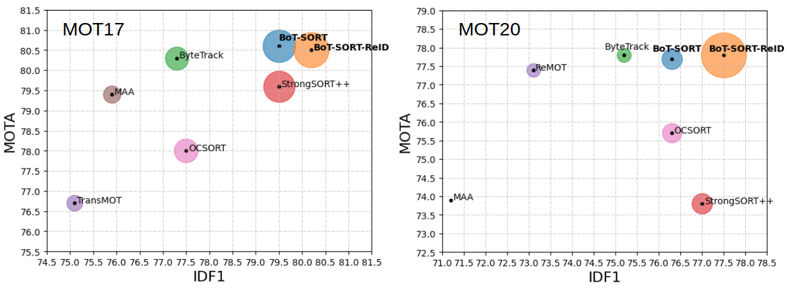

# BoT-SORT

> [**BoT-SORT: Robust Associations Multi-Pedestrian Tracking**](https://arxiv.org/abs/2206.14651)
> 
> Nir Aharon, Roy Orfaig, Ben-Zion Bobrovsky

[](https://paperswithcode.com/sota/multi-object-tracking-on-mot17?p=bot-sort-robust-associations-multi-pedestrian)

[](https://paperswithcode.com/sota/multi-object-tracking-on-mot20-1?p=bot-sort-robust-associations-multi-pedestrian)
> 
> *[https://arxiv.org/abs/2206.14651](https://arxiv.org/abs/2206.14651)*

<p align="center"></p>

## Highlights 🚀

- YOLOX & YOLOv7 support
- Multi-class support
- Camera motion compensation
- Re-identification

## Coming Soon
- [ ] Trained YOLOv7 models for MOTChallenge.
- [x] YOLOv7 detector.
- [x] Multi-class support.
- [x] Create OpenCV VideoStab GMC python binding or <u>write Python version<u>.
- [ ] Deployment code.

## Abstract

The goal of multi-object tracking (MOT) is detecting and tracking all the objects in a scene, while keeping a unique identifier for each object. In this paper, we present a new robust state-of-the-art tracker, which can combine the advantages of motion and appearance information, along with camera-motion compensation, and a more accurate Kalman filter state vector. Our new trackers BoT-SORT, and BoT-SORT-ReID rank first in the datasets of MOTChallenge [29, 11] on both MOT17 and MOT20 test sets, in terms of all the main MOT metrics: MOTA, IDF1, and HOTA. For MOT17: 80.5 MOTA, 80.2 IDF1, and 65.0 HOTA are achieved.


### Visualization results on MOT challenge test set


https://user-images.githubusercontent.com/57259165/177045531-947d3146-4d07-4549-a095-3d2daa4692be.mp4

https://user-images.githubusercontent.com/57259165/177048139-05dcb382-010e-41a6-b607-bb2b76afc7db.mp4

https://user-images.githubusercontent.com/57259165/180818066-f67d1f78-515e-4ee2-810f-abfed5a0afcb.mp4

## Tracking performance
### Results on MOT17 challenge test set
| Tracker       |  MOTA |  IDF1  |  HOTA  |
|:--------------|:-------:|:------:|:------:|
| BoT-SORT      |  80.6   |  79.5  |  64.6  |
| BoT-SORT-ReID |  80.5   |  80.2  |  65.0  |

### Results on MOT20 challenge test set
| Tracker       | MOTA   | IDF1 | HOTA |
|:--------------|:-------:|:------:|:------:|
|BoT-SORT       | 77.7   | 76.3 | 62.6 | 
|BoT-SORT-ReID  | 77.8   | 77.5 | 63.3 | 


## Installation

The code was tested on Ubuntu 20.04

BoT-SORT code is based on ByteTrack and FastReID. <br>
Visit their installation guides for more setup options.
 
### Setup with Anaconda
**Step 1.** Create Conda environment and install pytorch.
```shell
conda create -n botsort_env python=3.7
conda activate botsort_env
```
**Step 2.** Install torch and matched torchvision from [pytorch.org](https://pytorch.org/get-started/locally/).<br>
The code was tested using torch 1.11.0+cu113 and torchvision==0.12.0 

**Step 3.** Install BoT-SORT.
```shell
git clone https://github.com/NirAharon/BoT-SORT.git
cd BoT-SORT
pip3 install -r requirements.txt
python3 setup.py develop
```
**Step 4.** Install [pycocotools](https://github.com/cocodataset/cocoapi).
```shell
pip3 install cython; pip3 install 'git+https://github.com/cocodataset/cocoapi.git#subdirectory=PythonAPI'
```

Step 5. Others
```shell
# Cython-bbox
pip3 install cython_bbox

# faiss cpu / gpu
pip3 install faiss-cpu
pip3 install faiss-gpu
```

## Data Preparation

Download [MOT17](https://motchallenge.net/data/MOT17/) and [MOT20](https://motchallenge.net/data/MOT20/) from the [official website](https://motchallenge.net/). And put them in the following structure:

```
<dataets_dir>
      │
      ├── MOT17
      │      ├── train
      │      └── test    
      │
      └── MOT20
             ├── train
             └── test
```

For training the ReID, detection patches must be generated as follows:   

```shell
cd <BoT-SORT_dir>

# For MOT17 
python3 fast_reid/datasets/generate_mot_patches.py --data_path <dataets_dir> --mot 17

# For MOT20
 python3 fast_reid/datasets/generate_mot_patches.py --data_path <dataets_dir> --mot 20
```
Link dataset to FastReID ```export FASTREID_DATASETS=<BoT-SORT_dir>/fast_reid/datasets```. If left unset, the default is `fast_reid/datasets` 
 
## Model Zoo
Download and store the trained models in 'pretrained' folder as follow:
```
<BoT-SORT_dir>/pretrained
```
- We used the publicly available [ByteTrack](https://github.com/ifzhang/ByteTrack) model zoo trained on MOT17, MOT20 and ablation study for YOLOX object detection.

- Ours trained ReID models can be downloaded from [MOT17-SBS-S50](https://drive.google.com/file/d/1QZFWpoa80rqo7O-HXmlss8J8CnS7IUsN/view?usp=sharing), [MOT20-SBS-S50](https://drive.google.com/file/d/1KqPQyj6MFyftliBHEIER7m_OrGpcrJwi/view?usp=sharing).

- For multi-class MOT use [YOLOX](https://github.com/Megvii-BaseDetection/YOLOX) or [YOLOv7](https://github.com/WongKinYiu/yolov7) trained on COCO (or any custom weights). 

## Training

[//]: # (### Training the Detector)

[//]: # ()
[//]: # (Please refer to [ByteTrack]&#40;https://github.com/ifzhang/ByteTrack&#41; for training detector.)

### Train the ReID Module

After generating MOT ReID dataset as described in the 'Data Preparation' section.

```shell
cd <BoT-SORT_dir>

# For training MOT17 
python3 fast_reid/tools/train_net.py --config-file ./fast_reid/configs/MOT17/sbs_S50.yml MODEL.DEVICE "cuda:0"

# For training MOT20
python3 fast_reid/tools/train_net.py --config-file ./fast_reid/configs/MOT20/sbs_S50.yml MODEL.DEVICE "cuda:0"
```

Refer to [FastReID](https://github.com/JDAI-CV/fast-reid)  repository for addition explanations and options.

## Tracking

By submitting the txt files produced in this part to [MOTChallenge](https://motchallenge.net/) website and you can get the same results as in the paper.<br>
Tuning the tracking parameters carefully could lead to higher performance. In the paper we apply ByteTrack's calibration.

* **Test on MOT17**

```shell
cd <BoT-SORT_dir>
python3 tools/track.py <dataets_dir/MOT17> --default-parameters --with-reid --benchmark "MOT17" --eval "test" --fp16 --fuse
python3 tools/interpolation.py --txt_path <path_to_track_result>
```

* **Test on MOT20**

```shell
cd <BoT-SORT_dir>
python3 tools/track.py <dataets_dir/MOT20> --default-parameters --with-reid --benchmark "MOT20" --eval "test" --fp16 --fuse
python3 tools/interpolation.py --txt_path <path_to_track_result>
```

* **Evaluation on MOT17 validation set (the second half of the train set)**

```shell
cd <BoT-SORT_dir>

# BoT-SORT
python3 tools/track.py <dataets_dir/MOT17> --default-parameters --benchmark "MOT17" --eval "val" --fp16 --fuse

# BoT-SORT-ReID
python3 tools/track.py <dataets_dir/MOT17> --default-parameters --with-reid --benchmark "MOT17" --eval "val" --fp16 --fuse
```

* **Other experiments**

Other parameters can be used __without__ passing --default-parameters flag. <br>
For evaluating the train and validation sets we recommend using the official MOTChallenge evaluation code from [TrackEval](https://github.com/JonathonLuiten/TrackEval). 

```shell
# For all the available tracking parameters, see:
python3 tools/track.py -h 
```

* **Experiments with YOLOv7**

Other parameters can be used __without__ passing --default-parameters flag. <br>
For evaluating the train and validation sets we recommend using the official MOTChallenge evaluation code from [TrackEval](https://github.com/JonathonLuiten/TrackEval). 

```shell
# For all the available tracking parameters, see:
python3 tools/track_yolov7.py -h 
```

## Demo

Demo with BoT-SORT(-ReID) based YOLOX and multi-class.

```shell
cd <BoT-SORT_dir>

# Original example
python3 tools/demo.py video --path <path_to_video> -f yolox/exps/example/mot/yolox_x_mix_det.py -c pretrained/bytetrack_x_mot17.pth.tar --with-reid --fuse-score --fp16 --fuse --save_result

# Multi-class example
python3 tools/mc_demo.py video --path <path_to_video> -f yolox/exps/example/mot/yolox_x_mix_det.py -c pretrained/bytetrack_x_mot17.pth.tar --with-reid --fuse-score --fp16 --fuse --save_result
```

Demo with BoT-SORT(-ReID) based YOLOv7 and multi-class.
```shell
cd <BoT-SORT_dir>
python3 tools/mc_demo_yolov7.py --weights pretrained/yolov7-d6.pt --source <path_to_video/images> --fuse-score --agnostic-nms (--with-reid)
```

## Note

Our camera motion compensation module is based on the OpenCV contrib C++ version of VideoStab Global Motion Estimation, 
which currently does not have a Python version. <br>
Motion files can be generated using the C++ project called 'VideoCameraCorrection' in the GMC folder. <br> 
The generated files can be used from the tracker. <br>

In addition, python-based motion estimation techniques are available and can be chosen by passing <br> 
'--cmc-method' <files | orb | ecc> to demo.py or track.py. 

## Citation

```
@article{aharon2022bot,
  title={BoT-SORT: Robust Associations Multi-Pedestrian Tracking},
  author={Aharon, Nir and Orfaig, Roy and Bobrovsky, Ben-Zion},
  journal={arXiv preprint arXiv:2206.14651},
  year={2022}
}
```


## Acknowledgement

A large part of the codes, ideas and results are borrowed from 
[ByteTrack](https://github.com/ifzhang/ByteTrack), 
[StrongSORT](https://github.com/dyhBUPT/StrongSORT),
[FastReID](https://github.com/JDAI-CV/fast-reid),
[YOLOX](https://github.com/Megvii-BaseDetection/YOLOX) and
[YOLOv7](https://github.com/wongkinyiu/yolov7). 
Thanks for their excellent work!


